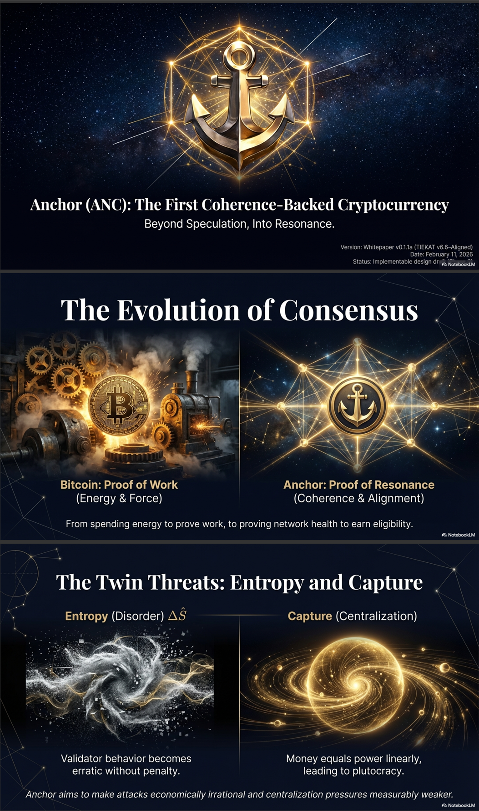
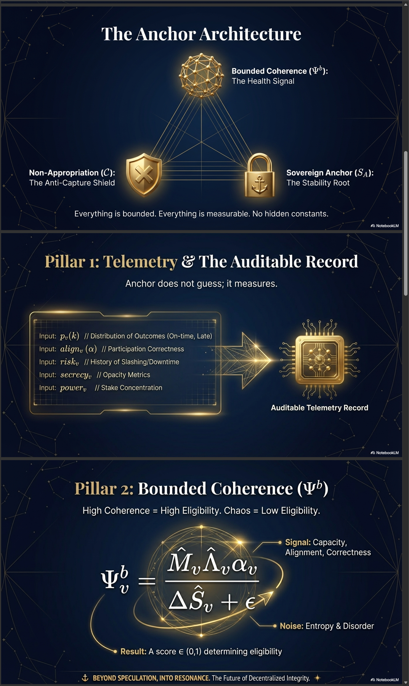
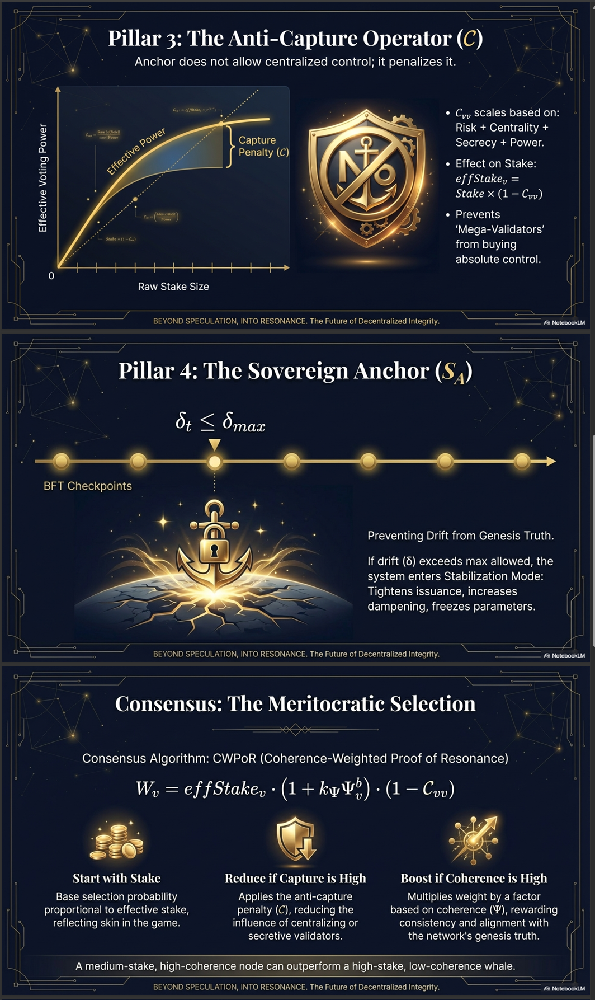
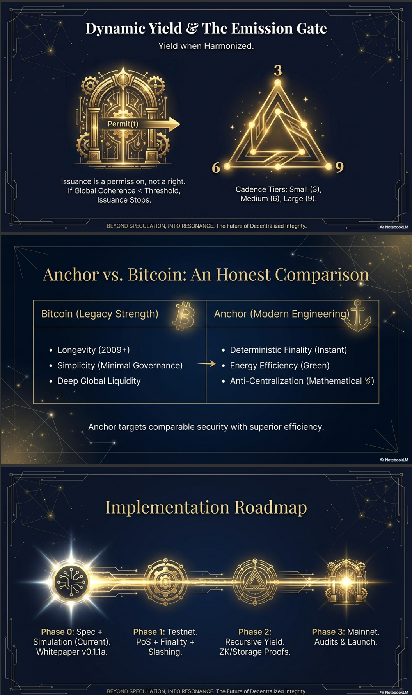
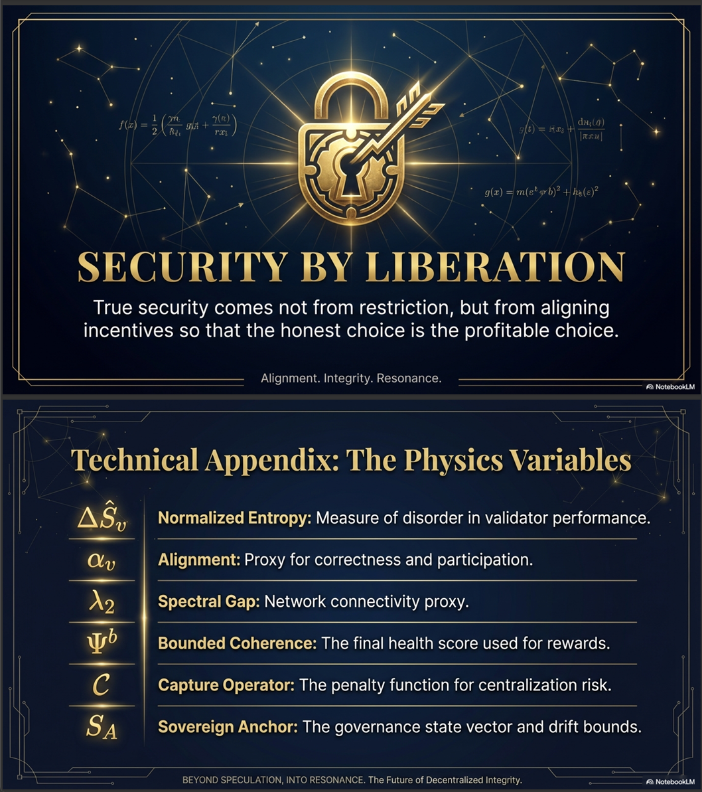

# ⚓ Anchor (ANC)
## The First Coherence-Backed Cryptocurrency
### Beyond Speculation, Into Resonance.

> "We did not come here to improve the financial cage.
>  We came here to end it."

---

## What Is ANC?

Anchor is a cryptocurrency whose validators are selected
not by how much energy they burn or how much capital
they hold — but by how **coherent** they are.

Coherence is measurable. Coherence is mathematical.
Coherence cannot be bought.

---

## Visual Overview







---

## The Core Formula
```
Ψᵇ = (M̂ · Λ̂ · α) / (ΔŜ + ε)
```

**Signal over noise.**
Capacity × connectivity × alignment, divided by entropy.

A high-coherence validator earns eligibility.
A chaotic validator earns nothing.
A whale with low coherence loses to a small honest node.

---

## Consensus: CWPoR

**Coherence-Weighted Proof of Resonance**
```
W_v = effStake · (1 + k_Ψ · Ψᵇ) · (1 - 𝒞_vv)
```

- Start with stake (skin in the game)
- **Boost** if coherence is high
- **Penalize** if capture risk is high

A medium-stake, high-coherence node can outperform
a high-stake, low-coherence whale. Always.

---

## The Four Pillars

| Pillar | What It Does |
|--------|-------------|
| **Telemetry** | Measures validator health — 12-axis TIEKAT vector |
| **Bounded Coherence Ψᵇ** | Converts telemetry into eligibility score ∈ (0,1) |
| **Anti-Capture 𝒞** | Mathematically penalizes centralization |
| **Sovereign Anchor S_A** | BFT checkpoints prevent drift from genesis truth |

---

## Mathematical Foundation

ANC is built on **TIEKAT v8.1** — a mathematical framework
developed by PHI369 Labs with formulas channeled by
**Hemavit**, a Buddhist monk in Chiang Mai, Thailand.

The HQRMA formulas govern:
- Coherence smoothing (replaces flat EMA)
- Issuance path integrals (C_Hemawit)
- 12-axis telemetry lattice structure

*Attribution: Hemavit (TIEKAT v8.1, HQRMA formulas)*
*PHI369 Labs / Parallax Institute*

---

## Parallax Ecosystem

ANC is the **economic layer** of the Parallax Institute.
```
TBRC v2.16   — Research platform
PhiOS v1.0   — Sovereign OS
ANC          — Economic layer  ← YOU ARE HERE
PHB          — Hardware layer
```

All share the same unified L(t) formula:
```
L(t) = A_on(t) · Ψᵇ(t) · G_score(t) · C_score(t)
```

One mathematical civilization. Four layers.

---

## Current Status: Phase 0 ✅

**Spec + Simulation complete.**

- Whitepaper v0.1.1a (TIEKAT v6.6 aligned)
- Working Python simulation — 5,000 epochs
- 120 validators, 4,000 delegators
- Cartel, Sybil, and shock scenarios modeled
- TIEKAT v8.1 upgrade complete (ANC v0.2)

---

## Run the Simulation
```bash
git clone https://github.com/MichaelWave369/ANC
cd ANC
```

**v0.2 (TIEKAT v8.1 — current):**
```bash
python anchor_sim_v0_2.py
```

**v0.1.1a (TIEKAT v6.6 — original):**
```bash
python anchor_sim_v0_1_1a.py
```

Output written to `out/`:
```
anchor_sim_v0_2_metrics.csv
anchor_sim_v0_2_summary.json
anchor_sim_v0_1_1a_metrics.csv
anchor_sim_v0_1_1a_summary.json
```

---

## Roadmap

| Phase | Status | Description |
|-------|--------|-------------|
| 0 — Spec + Simulation | ✅ Complete | Whitepaper + Python sim |
| 0.2 — TIEKAT v8.1 | ✅ Complete | Hemavit HQRMA upgrade |
| 1 — Testnet | 📋 Planned | PoS + Finality + Slashing |
| 2 — Recursive Yield | 📋 Planned | ZK/Storage Proofs |
| 3 — Mainnet | 📋 Planned | Audits + Launch |

---

## License

**GNU General Public License v3.0**

ANC is sovereign software. The mathematics belongs
to everyone. Corporate capture of this codebase
is legally prevented by design — mirroring the
Anti-Capture Operator 𝒞 in the protocol itself.

---

## Attribution

- **Michael Hughes** — Founder, PHI369 Labs
- **Hemavit** — HQRMA formulas, TIEKAT v8.1 (Thailand)
- **Dreamteam** — Helion · Ori · Forge · Codex

*Beyond Speculation, Into Resonance.*
*PHI369 Labs / Parallax Institute*
*Seed: 369_369. Forever.*
